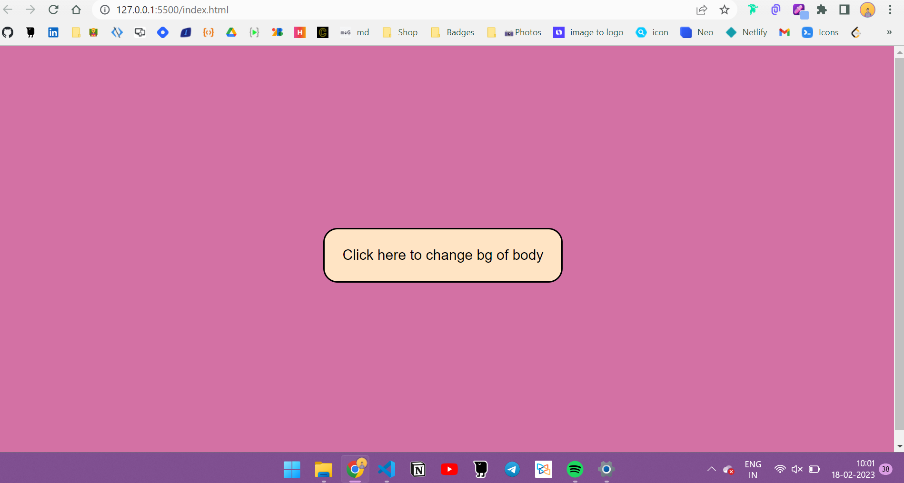

# Random Background Color Changer
- We create random hex color codes using javaScript.
- We create a button and when button is clicked the background color of the body of the page is changed.
  
## Here is the preview
  
  

